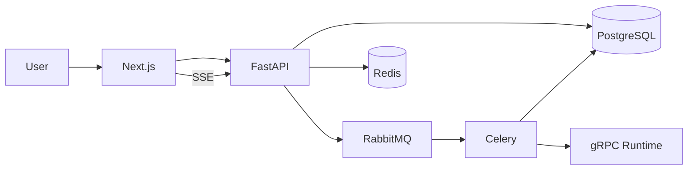
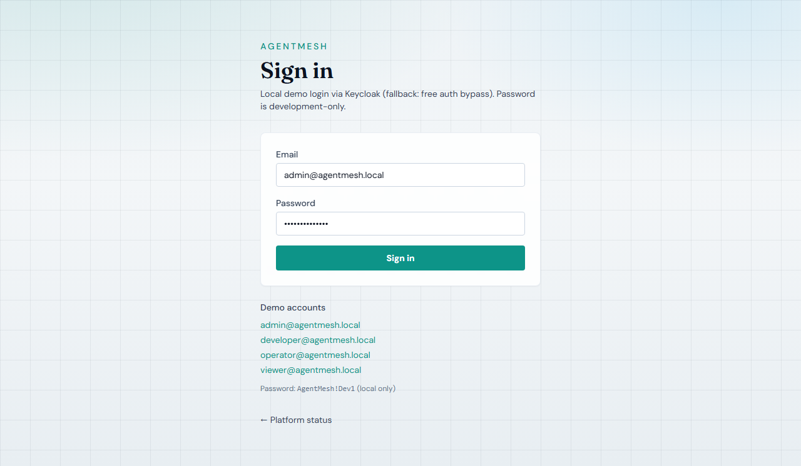
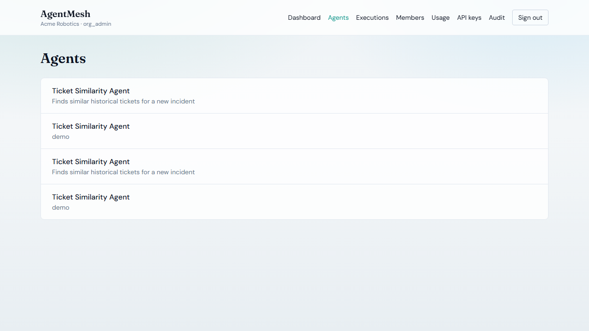
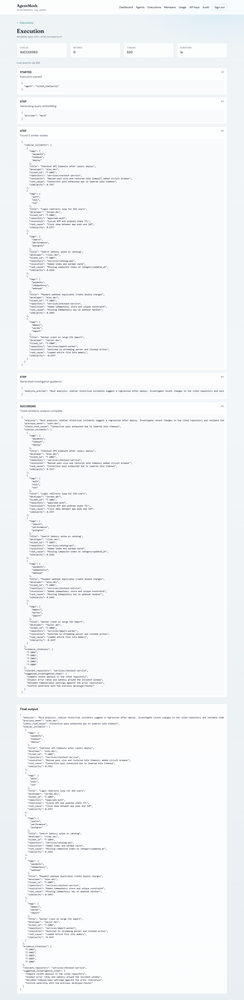
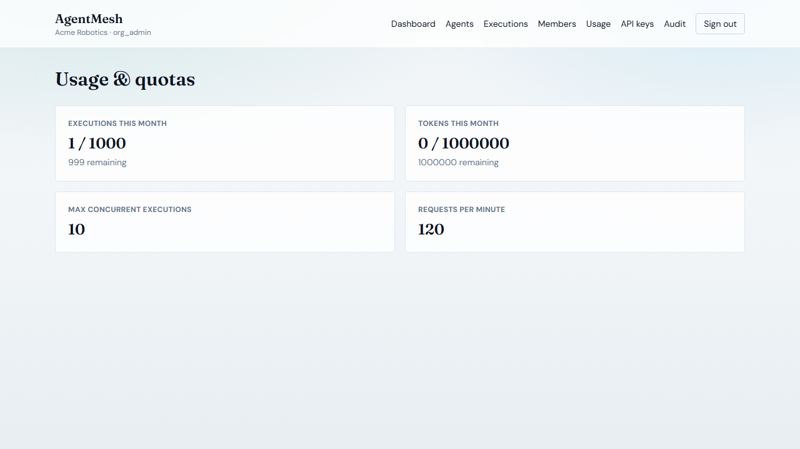
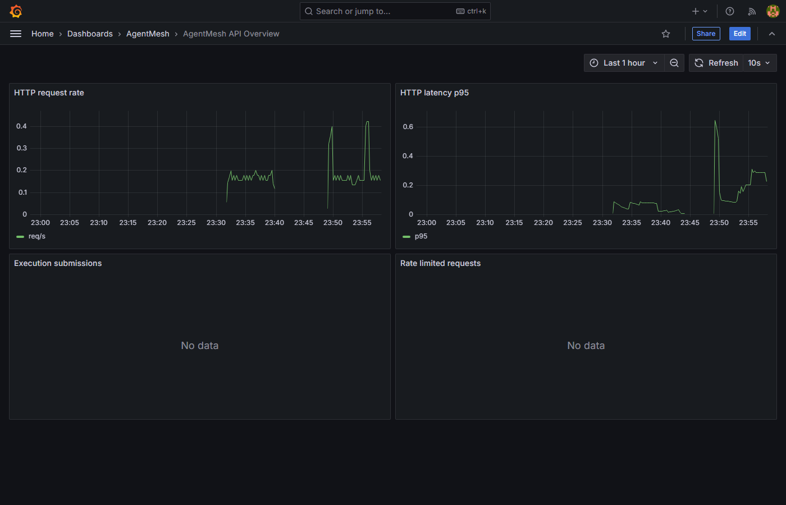

# AgentMesh

**Multi-Tenant AI Agent Execution Platform**

A production-quality portfolio project demonstrating full-stack and distributed-systems engineering for enterprise AI-agent platforms: OIDC authentication, RBAC, durable async agent executions, gRPC streaming runtime, live SSE monitoring, pgvector similarity search, and Kubernetes deployment.

> **Status:** Phases 0–10 complete for local Compose + K8s/CI portfolio demo. See [docs/implementation-plan.md](docs/implementation-plan.md).

## Why this project exists

Chatbots and CRUD apps do not demonstrate the skills required for agent platforms: multi-tenant isolation, durable queues, crash recovery, idempotency, live observability, and secure identity. AgentMesh is built to show those capabilities end-to-end, with a practical **Ticket Similarity Agent** as the sample AI use case.

## Features (target)

- OAuth2 / OpenID Connect login via Keycloak (Authorization Code + PKCE)
- Multi-tenant organizations with RBAC (Admin, Developer, Operator, Viewer)
- Immutable agent versioning and publish workflow
- Async executions via RabbitMQ + Celery (retries, DLQ, idempotency)
- gRPC AgentRuntimeService with server-streaming step events
- Live execution UI via Server-Sent Events + Redis Pub/Sub
- Ticket Similarity Agent with pgvector embeddings
- Rate limiting, quotas, API keys, append-only audit logs
- Docker Compose local stack; Kubernetes manifests; Prometheus / Grafana / Jaeger
- CI with lint, type-check, unit/integration tests, security scanning

## Architecture



Full diagrams: [docs/architecture.md](docs/architecture.md).

## Technology stack

| Layer | Technologies |
|-------|----------------|
| Frontend | Next.js, React, TypeScript, Tailwind, Redux Toolkit, RTK Query, Zod, RHF |
| Backend | Python, FastAPI, AsyncIO, Pydantic, SQLAlchemy 2 async, Alembic |
| Data | PostgreSQL, pgvector, Redis |
| Async | RabbitMQ, Celery |
| Internal RPC | gRPC, Protocol Buffers |
| Auth | Keycloak, OAuth2/OIDC, PKCE, JWT |
| Infra | Docker, Compose, Kubernetes, NGINX Ingress, HPA |
| Observability | Structured JSON logs, OpenTelemetry, Prometheus, Grafana, Jaeger |
| CI/CD | GitHub Actions, Ruff, MyPy, ESLint, Vitest, Pytest, Playwright |

## Repository layout

```
agentmesh/
├── apps/web/                 # Next.js frontend + BFF
├── services/api/             # FastAPI REST API
├── services/worker/          # Celery workers
├── services/runtime/         # gRPC agent runtime
├── packages/proto/           # Protocol Buffers
├── infrastructure/           # Docker, K8s, monitoring
├── scripts/                  # Dev and seed scripts
├── tests/                    # Integration + E2E
├── docs/                     # Architecture, ADRs, security
├── docker-compose.yml
├── Makefile
├── .env.example
└── README.md
```

## Local setup

### Prerequisites

- Docker Desktop with Compose v2
- Make (optional; or use Compose commands directly)
- Node 20+ and Python 3.12+ (for local non-Docker development)

### Quick start (Docker Compose)

```bash
cd agentmesh
cp .env.example .env
docker compose up --build -d
```

### Expected URLs

| Service | URL |
|---------|-----|
| Web | http://localhost:3000 |
| API health | http://localhost:8000/health |
| API ready | http://localhost:8000/ready |
| API docs | http://localhost:8000/docs |
| Keycloak | http://localhost:8080 |
| RabbitMQ management | http://localhost:15672 |
| Grafana | http://localhost:3001 |
| Prometheus | http://localhost:9090 |
| Jaeger UI | http://localhost:16686 |

### Demo users (local development only)

| Email | Role | Password |
|-------|------|----------|
| `admin@agentmesh.local` | Organization Admin | `AgentMesh!Dev1` |
| `developer@agentmesh.local` | Developer | `AgentMesh!Dev1` |
| `operator@agentmesh.local` | Operator | `AgentMesh!Dev1` |
| `viewer@agentmesh.local` | Viewer | `AgentMesh!Dev1` |

These credentials are **development-only**, loaded via Keycloak realm import. Never use them outside local demos.

## Environment variables

See [.env.example](.env.example). Copy to `.env` before starting Compose. Do not commit `.env`.

## Database migrations

```bash
docker compose exec api alembic upgrade head
```

(Available after Alembic is introduced in Phase 2/3.)

## Testing

```bash
# Backend
docker compose exec api pytest

# Frontend
docker compose exec web npm test

# Integration / E2E (later phases)
make test-integration
make test-e2e
```

## Kubernetes deployment

See [docs/deployment.md](docs/deployment.md) (Phase 9).

```bash
# Kind / Minikube examples will be documented there
kubectl apply -k infrastructure/kubernetes/
```

## API documentation

- OpenAPI UI: http://localhost:8000/docs
- Design notes: [docs/api-design.md](docs/api-design.md) (Phase 2+)

## Security design

See [docs/security.md](docs/security.md) and [docs/threat-model.md](docs/threat-model.md).

Highlights:

- OIDC + PKCE; tokens not stored in `localStorage`
- Tenant isolation in service layer
- RBAC via FastAPI dependencies
- API keys stored as hashes only

## Distributed-system guarantees

| Guarantee | Approach |
|-----------|----------|
| At-least-once task delivery | RabbitMQ + manual ack after durable side effects |
| No duplicate business execution | Idempotency keys + atomic status transitions |
| Crash recovery | Unacked messages redelivered; workers resume safely |
| Live event durability | Events in Postgres; Redis Pub/Sub for fan-out |
| Tenant isolation | `organization_id` from membership, never client trust |

Honest trade-off: at-least-once means handlers **must** be idempotent. Exactly-once is not claimed.

## Known limitations

- Mock LLM by default; quality depends on optional providers.
- Dev auth bypass / bearer tokens in client state — production should use BFF + HttpOnly cookies.
- Schema via startup `create_all` + seed; formal Alembic revision history is thin.
- Local K8s Postgres/Redis/RabbitMQ are for development only (plaintext Secret templates).
- Load-test numbers are not fabricated; see [docs/load-testing.md](docs/load-testing.md).

## Future improvements

- Postgres Row-Level Security
- Multi-region failover
- Cost attribution per model provider
- Native horizontal autoscaling from queue depth exporters
- Soft-delete and retention policies for audit/events

## Screenshots

| | |
|---|---|
| Login |  |
| Agents |  |
| Live execution (SSE) |  |
| Usage / quotas |  |
| Grafana |  |

Also captured: `04b-api-keys.png`, `04c-audit-logs.png`. Re-run with:

```bash
cd tests/e2e && npm install && npx playwright install chromium
CAPTURE_GRAFANA=1 PLAYWRIGHT_BASE_URL=http://localhost:3000 npx playwright test specs/capture-screenshots.spec.ts
```

## Interview talking points

Full answers: [docs/interview-talking-points.md](docs/interview-talking-points.md).

1. Why REST externally and gRPC internally
2. Why RabbitMQ is still required when gRPC exists
3. At-least-once delivery + idempotency design
4. SSE vs WebSockets for execution event streams
5. Shared-schema multi-tenancy isolation strategy
6. Immutable agent versions and execution reproducibility
7. BFF / HttpOnly session pattern vs storing JWTs in localStorage

## Documentation index

| Doc | Purpose |
|-----|---------|
| [implementation-plan.md](docs/implementation-plan.md) | Phased delivery plan |
| [architecture.md](docs/architecture.md) | System design |
| [deployment.md](docs/deployment.md) | Compose + Kubernetes + CI |
| [demo-script.md](docs/demo-script.md) | 2–3 minute demo |
| [interview-talking-points.md](docs/interview-talking-points.md) | Interview answers |
| [load-testing.md](docs/load-testing.md) | k6 template |
| [adr/](docs/adr/) | Architecture Decision Records |

## License

MIT (portfolio / educational use).
