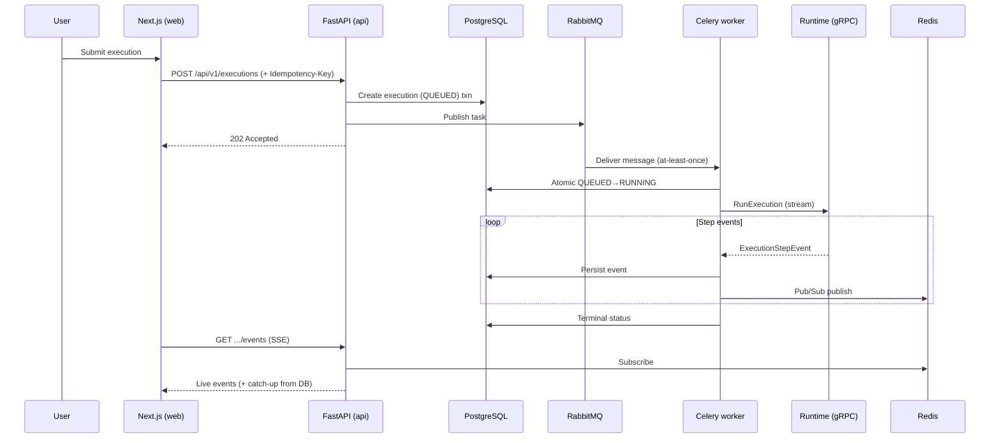
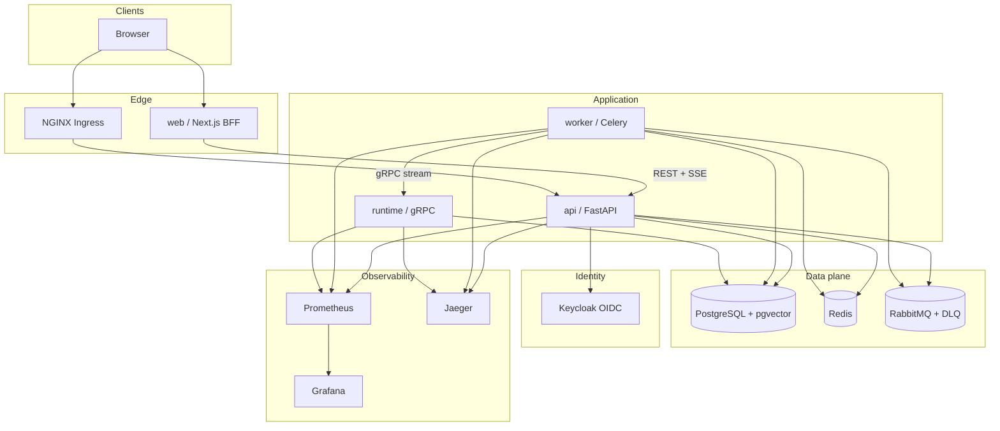
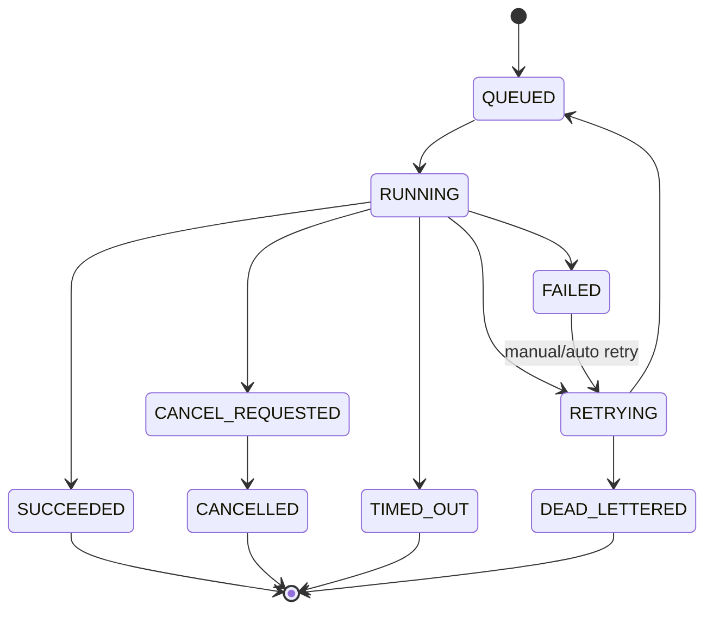

# AgentMesh Architecture

## Why this exists

AgentMesh demonstrates the systems skills expected for a Full-Stack Engineer at an enterprise AI-agent company: multi-tenancy, durable async execution, typed internal RPCs, live observability, and secure OIDC — not a thin chatbot wrapper.

## Deployable components

| Component | Role |
|-----------|------|
| **web** | Next.js BFF + dashboard (OIDC, agent UX, live executions) |
| **api** | FastAPI REST: authz, tenancy, agents, executions, SSE, audit |
| **worker** | Celery consumers: retries, DLQ, gRPC to runtime, event persistence |
| **runtime** | gRPC AgentRuntimeService with server-streaming step events |
| **PostgreSQL + pgvector** | System of record + ticket embeddings |
| **Redis** | Rate limits, Pub/Sub for SSE, caches |
| **RabbitMQ** | Durable execution queue + DLQ |
| **Keycloak** | OAuth2/OIDC identity provider |
| **Prometheus / Grafana / Jaeger** | Metrics, dashboards, traces |

## High-level execution flow

## Component diagram

## Boundary rationale

| Concern | Choice | Why |
|---------|--------|-----|
| Browser / public API | REST + OpenAPI | Cacheable, debuggable, browser-native, OpenAPI for clients |
| Live updates | SSE | Uni-directional server→client, auto-reconnect, `Last-Event-ID`, simpler than WS for event feeds |
| Internal agent steps | gRPC streaming | Strong typing, efficient binary framing, backpressure-friendly streams |
| Job durability | RabbitMQ + Celery | Survives crashes; ack/retry/DLQ; gRPC alone is not a durable queue |
| Tenancy | Shared schema + `organization_id` | Operational simplicity for portfolio scale; isolation enforced in services |

## Multi-tenancy

Shared database, shared schema. Every tenant-owned row carries `organization_id`. The active organization is derived from the authenticated principal and verified membership — never trusted from the client body alone.

## Status machine (executions)

## Observability spine

Every request carries a `correlation_id`. OpenTelemetry propagates `trace_id` across web → api → queue → worker → gRPC → DB. Structured JSON logs include org, user, execution, and correlation fields.

## Known architectural trade-offs

- **At-least-once** delivery requires idempotent handlers; duplicates are possible until DB constraints reject them.
- **SSE** is not ideal for bidirectional control channels (cancel uses REST).
- **Shared schema** multi-tenancy demands rigorous query discipline; row-level security may be added later.
- **Mock LLM** keeps local demos offline; production model quality depends on optional providers.
